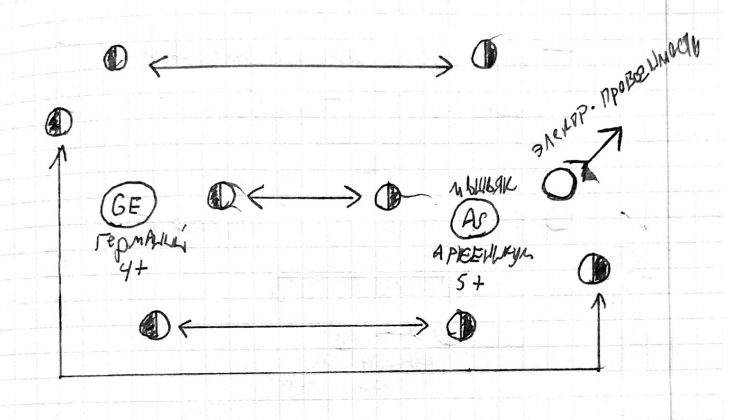
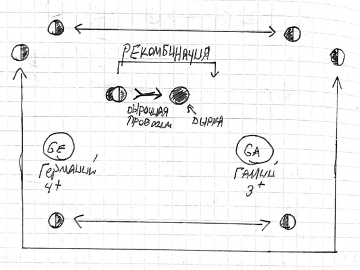
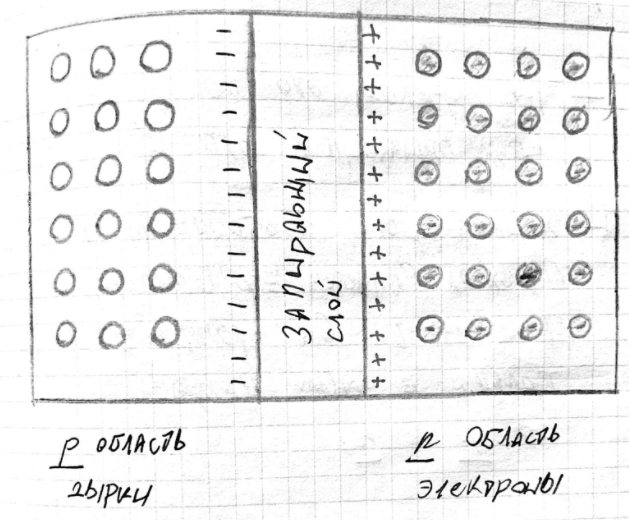
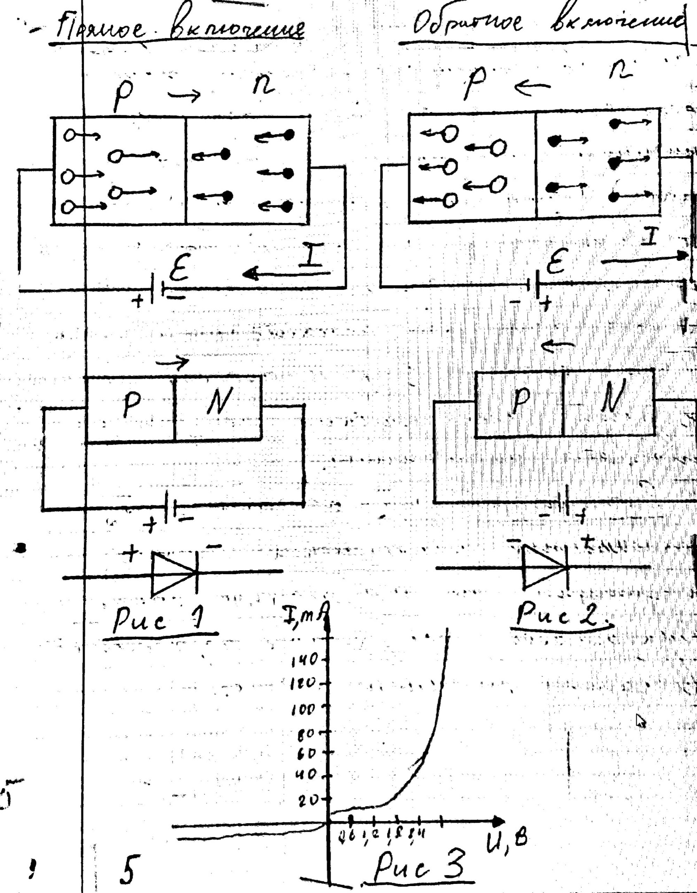

## Конспект

### Собственная и примесная проводимость полупроводников
**Полупроводники(п/п)** - это вещества в которых количество свободных зарядов зависит от внешних условий.

- Проводимость
    - Собственная
        - Электронная
        - Дырочная
    - Примесная
        - Донорная
        - Акцепторная
    
**Собственная проводимость** — это проводимость чистых полупроводников без примесей она определяется свойствами самого проводника.

**Электронная проводимость** — это проводимость свободных электронов, покинувших свой атом в результате нагревания.

**Дырка** — это вакантное место в атоме, образовавшиеся при уходе из него электрона, обладает положительным зарядом.

**Дырочная проводимость осуществляется** при направленном перемещении электронов на вакантные места.

***

### Донорные и Акцепторная примеси
| Примеси        | Носители           | Заряд  | Тип | Примечание |
| :------------- |:-------------:|:-----:|:-----: |:-----:|
| Донорная | электрон | - | n-тип | Негатив |
| Акцепторная | дырка | + | p-тип | Позитив |

**Донорные примеси** — это примеси создающие электронную проводимость n-типа со знаком " - " в электронном проводнике.

**Акцепторные примеси** — это примеси создающие дырочную проводимость p-типа со знаком " + " в электронном проводнике.

Собственная проводимость полупроводника очень мала, поэтому используют примеси, которые позволяют её увеличить.

Примесь — это введение атомов посторонних химических элементов в полупроводнике.

##### Пример донорной примеси:

Типичным примером донорной примеси для Германия Ge(4+) является мышьяк арсеникум As (5+).

4 электрона мышьяка связаны с сильными связями с 4 электронами Германия, пятый электрон остаётся свободным. Он легко отрывается от атома и возникает электронная проводимость.

П/п с донорной примесью является п/п типа n-типа, он обладает электронной проводимость со знаком " - ".

##### Пример акцепторной примеси

Акцепторной примесью для Германия Ge(4+) является Ga(3+)

У Галия не хватает одного электрона и недостающая связь является дыркой. Эту дырку заполняет электрон соседнего атома(рекомбинация) и возникает дырочная проводимость.

П/п с акцепторной примесью является п/п типа p-типа, он обладает электронной проводимость со знаком " + ".

### P-N переход

В полупроводниковых приборах используется контакт находящийся на границе p и n типа.

P-N переход — это контактный слой двух примесных полупроводников p и n типа.

Характерной особенностью P-N перехода является его односторонняя проводимость. Он пропускает ток только в одном направлении от p к n.

При возникновении контакта между полупроводниками p и n типа, свободные электроны из n-области(где их много) начинаю перемещение в p-область(где их мало). Аналогично дырки из p-области переход в n-области.

p-область приобретает отрицательный заряд. n-область положительный заряд.

Таким образом, в P-N переходе образуется двойной электрический слой, который называется **запирающим**.

**Запирающий слой** — это двойной слой разноимённых электрических зарядов, который препятствует их свободному перетеканию на P-N переходе.

#### Прямое включение P-N перехода(рис. 1).
Если плюс приложить к p-области, а минус к n-области полупроводника — это **прямое включения P-N перехода**.

В этом случае в p-области к переходу будут двигаться дырки, а в n-области к переходу двигаться электроны.

При прямом включении электрический ток:

1) Образован основными носителями
2) протекает в прямом направлении от p к n
3) является большим.

#### Обратное включение P-N перехода
Если плюс приложить к n-области, а минус к p-области полупроводника — это **обратное включения P-N перехода**.

В этом случае и дырки и электроны будут двигаться от перехода, создавая на нём зону, лишённую носителей заряда.

При обратном включении электрический ток:
1) Образован не основными носителями
2) протекает в обратном направлении от p к n
3) очень мал, можно пренебречь.

**Вывод:** при прямом включении P-N переход открыт и пропускает электрический ток, при обратном включении P-N переход закрыт, ток очень мал, им можно пренебречь.

Способность P-N перехода пропускать ток только в одном направлении называется **односторонней проводимостью**.

**[ВАХ] Вольт-амперная характеристика(рис. 3)** - это зависимость силы тока, который протекает через P-N переход, от велечины и полярности приложенного перехода напряжения.

